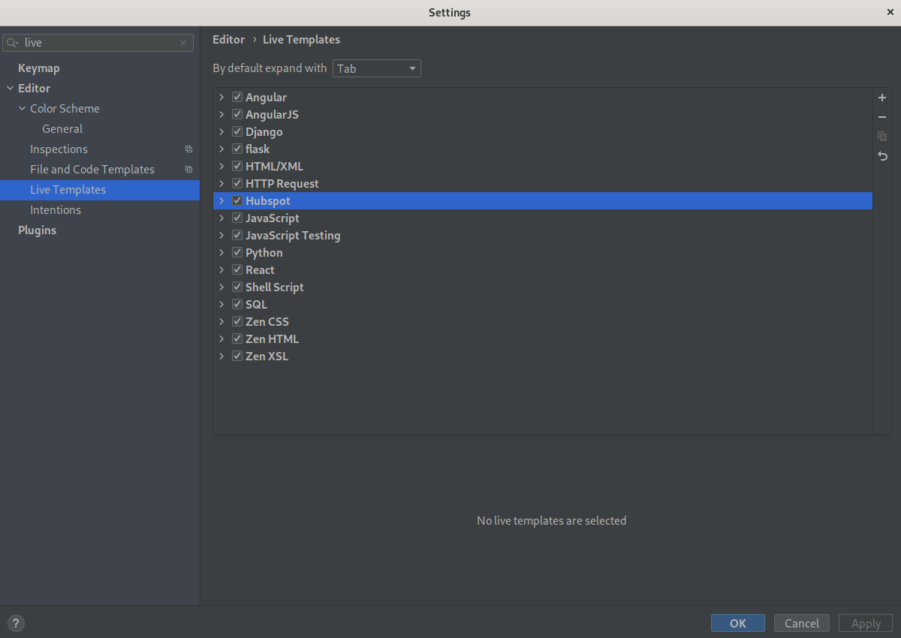
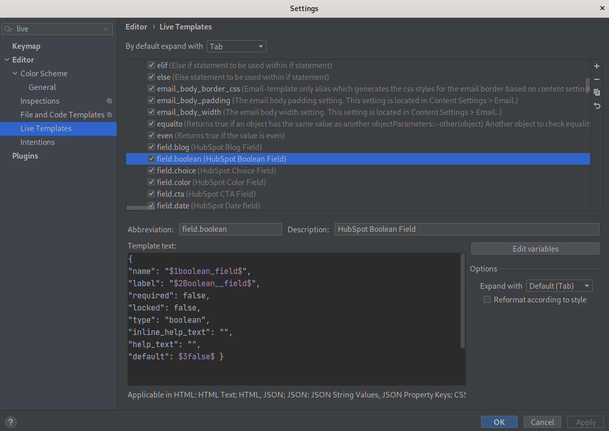
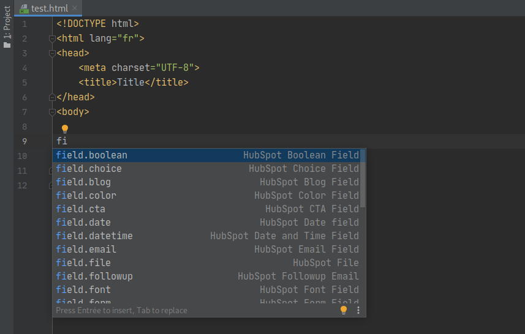

# hubspot-cms-JetBrains

For fast HubSpot CMS Hub development with JetBrains IDEs (Webstorm, PHPStorm, Pycharm, etc.).

Those files adapts the [HubSpot Visual Studio Code Extension](https://github.com/HubSpot/hubspot-cms-vscode) for JetBrains IDEs (Webstorm, PHPStorm, Pycharm, etc.) and it currently supports:
- ~~Syntax highlighting for the HubL templating language~~ ¹
- Autocomlete for common HubL tags, filters, module fields, and functions
- ~~Bracket wrapping, indentation, and other helpful editor features~~ ²

If you're new to CMS Hubspot, check out how to [get started with local development.](https://designers.hubspot.com/docs/tools/local-development) and the [HubL templating language](https://designers.hubspot.com/docs/hubl/intro-to-hubl).

## About 

Autocompletion use Live templating of JetBrains IDEs (Webstorm, PHPStorm, Pycharm, etc.).

Go to `Get started` section to use it quickly.

Or see documentation of sharing live templates [here](https://www.jetbrains.com/help/idea/sharing-live-templates.html) if you want to know more. 

## Getting started

### Copy one file
Copy the file `templates/hubspot.xml` in the `templates` directory of the IDE configuration directory (see [this page](https://www.jetbrains.com/help/idea/tuning-the-ide.html#config-directory) to know where is this folder on your OS).

#### Linux

On Debian systems, copy the file in `~/.config/[JetbrainsIDEName]/templates`.

#### MAC

Copy the file in `~/Library/Application Support/JetBrains/[JetbrainsIDEName]/jba_config/templates`.

### Activate the Hubspot live template
In your IDE (Webstorm, PHPStorm, Pycharm, etc.), go to **settings** or **Preferences** section (**IDE name | Preferences** for macOS or **File | Settings** for Windows and Linux), and choose **Editor** > **Live templates** (or search `Live templates`) and check the **Hubspot** box.

### Restart you IDE
When you have restarted your IDE, you will be able to type first letters of the abbreviation you want and then press **Ctrl** + **Space** and you'll have Hubspot propositions.

## Abbreviations documentation

[Full documentation](REFERENCES.md)

## Troubleshootings

### Emmet
When autocompletion is done, you can switch between variables of the inserted code by pressing `tab`. But if Emmet is activated, this press on `tab` will create in html files a tag with the string you've just entered.

#### If you're not using Emmet
Deactivate it: go to **settings** or **Preferences** section (**IDE name | Preferences** for macOS or **File | Settings** for Windows and Linux), and choose **Editor** > **Emmet** (or search `Emmet`), then unckeck `Enable Emmet` on each subsection (`HTML`, `CSS`, `JSX`).

#### If you're using Emmet
Just change what you expand abbreviation with: go to **settings** or **Preferences** section (**IDE name | Preferences** for macOS or **File | Settings** for Windows and Linux), and choose **Editor** > **Emmet** (or search `Emmet`), then choose something else than `tab` for the `Expand abbreviation with` option.

### File types
For simplicity reasons, all abbreviations are setting for HTML, CSS, and JSON files. If it's not efficient enough, we will change it. 

## Notes
¹. To create a Hubl specific syntax higlighting, see [this documentation](https://jetbrains.org/intellij/sdk/docs/reference_guide/custom_language_support.html).

². Activate Jinja language support to have a part of these features.